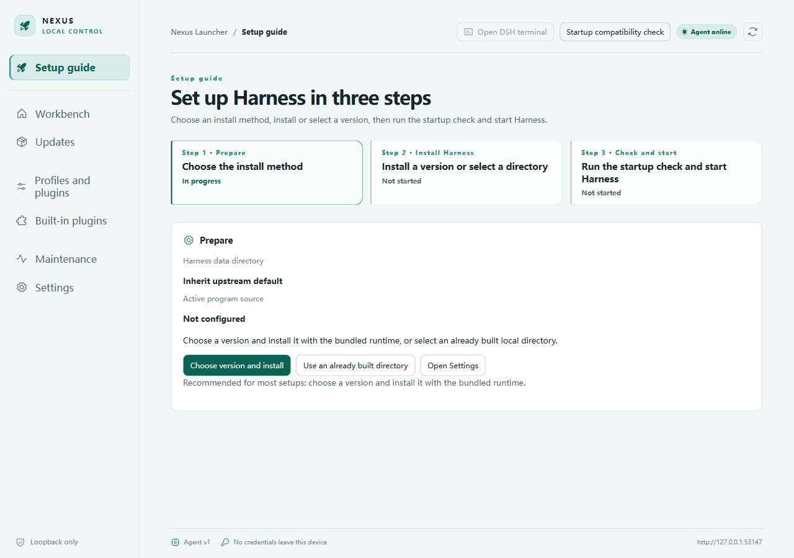

# Nexus Launcher

[简体中文](README.zh-CN.md)

Keep control of your Harness versions, runtime, and data.

Nexus is a local Harness manager for Windows and macOS, with a new Linux ARM64 build target. It prepares runtimes, installs or connects Harness, checks startup readiness, manages processes and versions, and assists recovery. Use your system browser for Web, or launch the native Desktop included in the selected managed Harness release. Nexus no longer maintains a replacement client shell. Desktop dependencies ship with Nexus and travel with full offline packages; import and launch never download missing dependencies. The pinned official Desktop runtime supports Windows x64 and macOS x64/ARM64; Windows ARM64 and Linux ARM64 currently offer Web mode. Desktop actions appear only when supported by the selected Harness and platform.

[Downloads](https://github.com/chelal233/dsh-nexus/releases) · [User guide](docs/user-guide.en.md) · [FAQ](docs/faq.en.md) · [Documentation](docs/README.en.md)

*Real React UI in an isolated first-use environment, with no Harness installed. See [screenshot provenance](docs/images/README.en.md).*

## What Nexus provides

- **Version choice**: keep up to eight managed version slots by default; prepare versions from upstream tags and switch explicitly, or connect your own prebuilt Harness directory.
- **Bundled environment**: Chromium, the Rust Agent, and Node/npm/pnpm are included. Users do not need the Nexus development toolchain.
- **Plugin choice**: choose a plugin market or install none. Built-in extensions are modular; Nexus does not operate its own plugin catalog source.
- **Task notifications**: choose event categories, desktop or terminal delivery, and unfocused-only or always conditions. Available events depend on Harness and its observer plugin.
- **Recoverable failures**: startup checks, compatibility checks, checkpoints, and diagnostic export help investigate problems without resetting all user data.
- **Chinese and English**: both are available in the interface and maintained usage documentation.

Nexus does not replace the Harness Agent, sessions, or model features, and does not guarantee every Harness/plugin combination. Updating Nexus and switching Harness are separate operations.

## Download and install

| Platform | Architecture | Downloads |
| --- | --- | --- |
| Windows | x64, ARM64 | EXE installer or portable ZIP |
| macOS | Intel x64, Apple Silicon ARM64 | DMG or application ZIP |
| Linux | ARM64 | AppImage, DEB, RPM (native build and acceptance pending) |

Nexus covers only platforms supported by both Harness and Electron; it does not port unsupported upstream targets. There are no 32-bit x86 packages. Linux ARM64 build jobs are configured; downloads depend on successful native CI and actual release assets. This does not establish compatibility with every Linux distribution. Use the release tag, assets, and `_build.json` to identify a build. A prerelease is not a stability guarantee. Signing status is specific to each artifact; see [security](SECURITY.en.md).

Extract the entire Windows ZIP, then run `Nexus Launcher.exe`. Do not copy only the executable. Portable means installation-free, not that all user data lives beside the executable. On macOS, copy the complete application to its intended location before opening it.

## Start in three steps

1. Open Nexus and confirm the Agent is online.
2. Install a managed Harness from the guide, or connect a prebuilt external directory.
3. Confirm the data directory and profile, resolve blocking startup checks, start Harness, and choose how to open it.

Initial Harness preparation may download dependencies and build them. A fully prepared Harness can start offline, but model services and network plugins may still require connectivity. Nexus does not automatically install compilers required by upstream native dependencies.

## Programs and data are separate

| Content | Behavior |
| --- | --- |
| Nexus program | Installed application or complete extracted directory |
| Nexus data | Configuration, version slots, operation records, diagnostics; separate from program files |
| Harness data, `DSH_HOME` | Configurable path; changing it does not move or delete existing data |
| External Harness | Checked and launched, not automatically updated, compiled, or deleted |
| Project workspace | Managed by Harness; distinct from the program directory and `DSH_HOME` |

## Documentation and contributions

- Usage: [user guide](docs/user-guide.en.md), [configuration](docs/configuration.en.md), [troubleshooting](docs/troubleshooting.en.md).
- Development: [contributing](CONTRIBUTING.en.md), [architecture](docs/architecture-baseline.en.md), [releases](docs/github-release.en.md), [plugins](plugins/README.en.md).
- Status: [changelog](CHANGELOG.en.md), [limitations](docs/known-limitations.en.md), [historical evidence](docs/history/README.en.md).

Nexus is independent and is not an official upstream Harness release. Nexus code uses [MIT](LICENSE); dependencies retain their own licenses. See [third-party notices](THIRD_PARTY_NOTICES.en.md).

## Community

- Thanks to the [LINUX DO](https://linux.do/) community for providing an open and welcoming platform for technical discussion.
