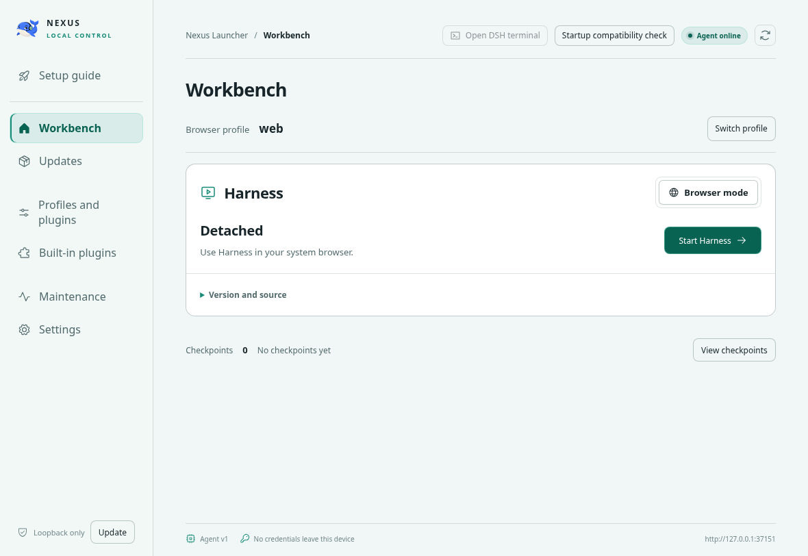
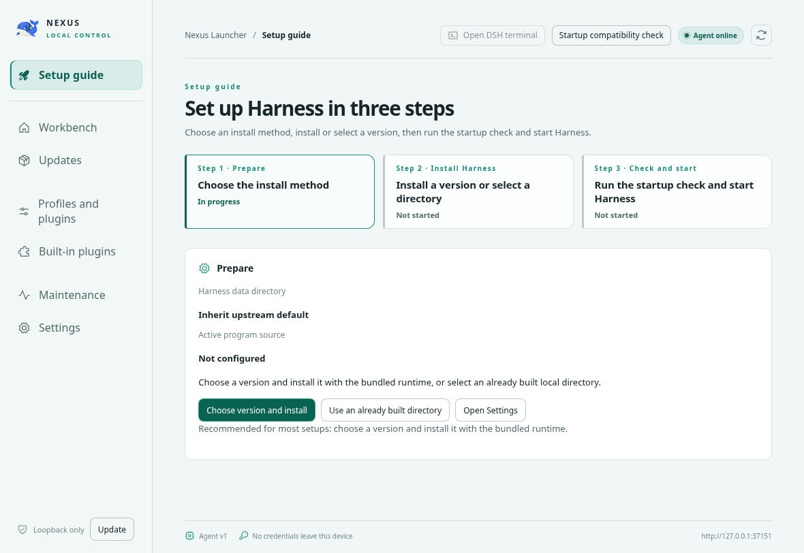
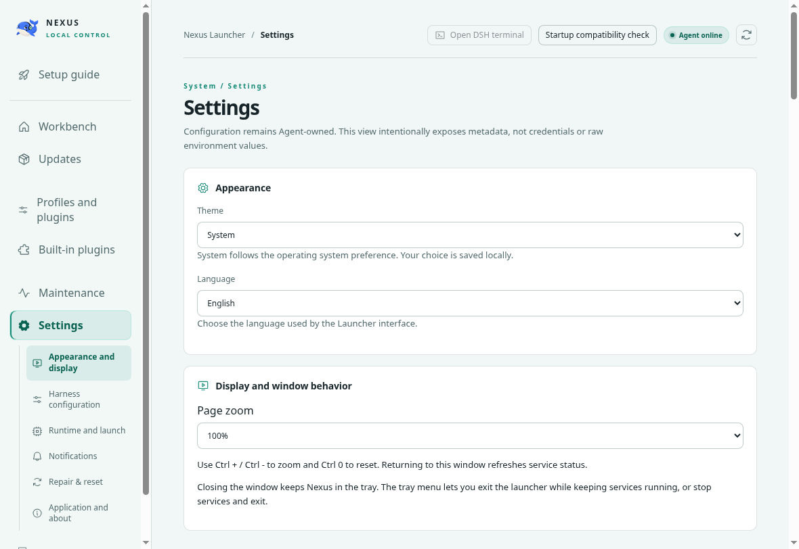

# Nexus Launcher

[简体中文](README.zh-CN.md)

**Manage Harness versions, launch it your way, and keep control of your local data.**

Nexus is a local desktop manager for [DeepSeek Harness](https://github.com/deepseek-ai/deepseek-harness), available for Windows, macOS, and Linux. Prepare and switch versions, launch Web or supported official Desktop, manage profiles and plugins, and recover from startup problems in one place.

[Download v1.0.5](https://github.com/chelal233/dsh-nexus/releases/tag/v1.0.5) · [Get started](#start-in-three-steps) · [User guide](docs/user-guide.en.md) · [Documentation](docs/README.en.md)

*All screenshots show v1.0.5 on Debian 13 x86_64, running unchanged files extracted from the official DEB with isolated data: Agent online, no Harness installed or running. This was not a system installation. See [capture details](docs/images/README.en.md).*

## What you can do

- **Prepare versions before switching.** Keep managed Harness versions side by side, switch explicitly after stopping Harness, or connect an existing prebuilt directory.
- **Choose Web or official Desktop.** Open Web Harness in your browser, or use the upstream Desktop included in a compatible managed release. The workbench shows the active mode, profile, startup status, and controls.
- **Manage configuration and plugins.** Select Web profiles, use the selected Harness version's official plugin manager where available, and inspect configuration without starting its plugins. Desktop uses its own `desktop` profile.
- **Recover with evidence.** Inspect startup failures, preview local dependency repairs, edit damaged profiles with configuration recovery points, and collect diagnostics. Normal startup starts the actual instance; additional diagnosis is available when needed.
- **Move a prepared environment offline.** Export the program, matching runtimes, and selected profiles/data, then import on the same OS and architecture. Choose exactly which contents to transfer.
- **Stay in control of local services.** Use the workbench and tray to start, open, restart, or stop supported modes. Choose whether to keep Harness running when exiting Nexus. Chinese and English interfaces are included, with configurable task notifications.

Nexus manages the Harness lifecycle; Harness provides the AI agent, models, tools, and conversations. The Nexus background Agent is the local management service, separate from Harness's AI agent.

## Download and install

The current release is **[v1.0.5](https://github.com/chelal233/dsh-nexus/releases/tag/v1.0.5)**. Choose the package matching your operating system and CPU architecture.

| Platform | Architecture | Downloads | Official Harness Desktop |
| --- | --- | --- | --- |
| Windows | x64 | [EXE installer](https://github.com/chelal233/dsh-nexus/releases/download/v1.0.5/dsh-nexus_1.0.5_windows_x64.exe) · [Portable ZIP](https://github.com/chelal233/dsh-nexus/releases/download/v1.0.5/dsh-nexus_1.0.5_windows_x64_portable.zip) | Compatible managed releases |
| Windows | ARM64 | [EXE installer](https://github.com/chelal233/dsh-nexus/releases/download/v1.0.5/dsh-nexus_1.0.5_windows_arm64.exe) · [Portable ZIP](https://github.com/chelal233/dsh-nexus/releases/download/v1.0.5/dsh-nexus_1.0.5_windows_arm64_portable.zip) | Unavailable with the bundled lock |
| macOS | Intel x64 | [DMG](https://github.com/chelal233/dsh-nexus/releases/download/v1.0.5/dsh-nexus_1.0.5_macos_x64.dmg) · [Application ZIP](https://github.com/chelal233/dsh-nexus/releases/download/v1.0.5/dsh-nexus_1.0.5_macos_x64_portable.zip) | Compatible managed releases |
| macOS | Apple Silicon ARM64 | [DMG](https://github.com/chelal233/dsh-nexus/releases/download/v1.0.5/dsh-nexus_1.0.5_macos_arm64.dmg) · [Application ZIP](https://github.com/chelal233/dsh-nexus/releases/download/v1.0.5/dsh-nexus_1.0.5_macos_arm64_portable.zip) | Compatible managed releases |
| Linux | x86_64 / x64 | [AppImage](https://github.com/chelal233/dsh-nexus/releases/download/v1.0.5/dsh-nexus_1.0.5_linux_x64.AppImage) · [DEB](https://github.com/chelal233/dsh-nexus/releases/download/v1.0.5/dsh-nexus_1.0.5_linux_x64.deb) · [RPM](https://github.com/chelal233/dsh-nexus/releases/download/v1.0.5/dsh-nexus_1.0.5_linux_x64.rpm) | Unavailable with the bundled lock; use Web |
| Linux | ARM64 | [AppImage](https://github.com/chelal233/dsh-nexus/releases/download/v1.0.5/dsh-nexus_1.0.5_linux_arm64.AppImage) · [DEB](https://github.com/chelal233/dsh-nexus/releases/download/v1.0.5/dsh-nexus_1.0.5_linux_arm64.deb) · [RPM](https://github.com/chelal233/dsh-nexus/releases/download/v1.0.5/dsh-nexus_1.0.5_linux_arm64.rpm) | Unavailable with the bundled lock; use Web |

Web mode is available on all six targets. Desktop availability depends on the selected Harness release and its runtime resources; a Nexus package alone does not establish Desktop support.

- **Windows:** install the EXE, or extract the complete ZIP before running `Nexus Launcher.exe`. Keep its resource files together. Portable means installation-free; user data is stored separately.
- **macOS:** copy the complete application from the DMG or ZIP before opening it. v1.0.5 packages are ad-hoc signed and **not notarized**.
- **Linux:** the full bundled runtime requires **glibc 2.34 or newer**, libcurl, zlib, and Electron's desktop libraries. DEB/RPM declare dependencies; AppImage users must check their system. A matching package format or a distribution name such as deepin, UOS, or Kylin does not guarantee compatibility with every version or desktop environment.

Release assets include build metadata and SHA-256 manifests. Windows and Linux packages are unsigned. See [download verification and security](SECURITY.en.md); the manifest's Sigstore provenance is separate from operating-system code signing.

## Start in three steps

1. **Open Nexus.** Confirm its local Agent is online, and follow any displayed startup guidance.
2. **Choose Harness.** Prepare a managed release and select it, import a complete offline package, or connect an external directory that is already built. Preparing a release does not automatically switch the active version.
3. **Choose your mode and start.** For Web, check the data directory and selected profile, resolve blocking checks, and start from Workbench. Open the browser once the client is ready. If official Desktop is available, select it and manage its configuration in its own window.

## Versions, configuration, and the Agent

**Updating Nexus and switching Harness are separate actions.** Nexus does not automatically upgrade your Harness installation. v1.0.5 fixes a race in which background Desktop capability checks could restart an explicitly stopped Nexus Agent.

The bundled Desktop runtime lock remains **Harness 0.1.6-alpha.2**. Nexus also adapts to selected newer Harness interfaces, including 0.2 settings and Desktop preparation. Interface support does not establish compatibility with every plugin or session-data migration. Keep a pre-upgrade data backup; selecting an older version does not downgrade upstream data formats.

Explicit Node, pnpm, and Git paths take priority; otherwise Nexus uses bundled tools. Bundled Git includes SSH and Git LFS, and excludes GCM. Runtime and launch settings apply to subsequent starts, not processes already running.

Web uses the profile selected in Nexus; official Desktop uses `profiles/desktop`. Their plugin settings do not synchronize automatically. Stop the active mode before switching modes or versions, changing protected configuration, or transferring data. Closing a window can leave services running; use the explicit Stop or stop-all-services-and-exit action when needed.

*The top of Settings; additional sections are available by scrolling.*

## Offline transfer and data safety

From a prepared environment, export a **full offline package** with **Program and runtime** and the profiles, installed plugins/dependencies, and data you need. Import it on the **same OS and architecture**. Inspect the package contents before selecting what to import; Harness remains stopped afterward. Configuration/data-only packages cannot supply a missing program or runtime.

Remote models, plugin downloads, and other network services still need connectivity unless those services run locally. An external source checkout must already be built; Nexus does not install its development toolchain for you.

Offline archives are **not encrypted**. Credentials and `.env` are optional sensitive contents; session history may also contain private information. Transfer only what you need, protect the archive, and import only from trusted sources. Project workspace files are not included in session-history transfer.

Nexus program files, Nexus management data, Harness data (`DSH_HOME`), and project workspaces are separate. Changing `DSH_HOME` does not move or delete the old directory. Configuration recovery points and snapshots cover their declared scope, not a complete backup of every project, session, and secret.

## Compatibility and verification

- Startup status distinguishes checking, ready, limited, failed, and unverified states. A running process or open window does not prove every model, tool, conversation, or third-party plugin works.
- v1.0.5 release gates cover six-platform builds, resource verification, and installed-package startup on CI runners. CI success and checksum provenance do not establish production OS signing, every Linux distribution, or real-device upgrades.
- macOS full in-browser Web sessions, real-session/full offline migration, every third-party plugin, physical-device upgrades, Gatekeeper first-open, production notarization, and crash recovery remain outside the accepted scope. Earlier v1.0.4 Mac subset checks are not v1.0.5 full migration acceptance. See the [v1.0.5 release notes](https://github.com/chelal233/dsh-nexus/releases/tag/v1.0.5).
- Harness and its plugins run with normal local-process capabilities. Nexus is not a sandbox for untrusted plugins.

## Documentation and contributions

- Use Nexus: [user guide](docs/user-guide.en.md), [configuration](docs/configuration.en.md), [troubleshooting](docs/troubleshooting.en.md), [official Desktop](docs/harness-desktop.en.md)
- Develop: [contributing](CONTRIBUTING.en.md), [development setup](apps/nexus-launcher/README.en.md), [architecture](docs/architecture-baseline.en.md), [release process](docs/github-release.en.md), [plugins](plugins/README.en.md)
- Follow changes: [releases](https://github.com/chelal233/dsh-nexus/releases), [changelog](CHANGELOG.en.md), [historical evidence](docs/history/README.en.md)

Nexus is an independent project, not an official upstream Harness release. Nexus code is [MIT licensed](LICENSE); third-party components retain their own licenses. See [third-party notices](THIRD_PARTY_NOTICES.en.md).

Thanks to the [LINUX DO](https://linux.do/) community for its open and welcoming technical discussions.
