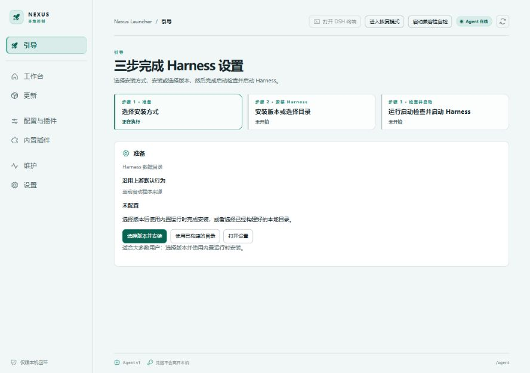

# Nexus Launcher

[English](README.md)

让 Harness 的版本、运行环境和数据由你掌控。

Nexus 是面向 Windows 和 macOS 的本地 Harness 管理工具。它负责准备运行环境、安装或关联 Harness、启动检查、进程管理、版本切换和故障恢复。你可以使用系统浏览器，也可以选择现有独立窗口入口；两种方式复用同一个 Harness。

[下载安装](https://github.com/chelal233/dsh-nexus/releases) · [用户指南](docs/user-guide.md) · [常见问题](docs/faq.md) · [文档目录](docs/README.md)

*真实 React 界面，隔离的首次使用环境，尚未安装 Harness。截图来源与限制见[截图说明](docs/images/README.md)。*

## Nexus 提供什么

- **版本选择自由**：准备上游标签对应的受管版本，确认后再切换；也可以使用自己的已构建 Harness 目录。
- **环境随包提供**：包含 Chromium、Rust Agent、Node/npm/pnpm；普通用户不必先安装 Nexus 开发工具链。
- **插件选择自由**：提供市场选择入口，也允许不安装市场；内置功能插件按模块维护，不自建插件目录源。
- **任务通知**：按事件分类控制系统通知和终端提醒，支持仅失焦或始终提醒；可用事件取决于 Harness 及监听插件。
- **故障可诊断**：启动检查、兼容性检查、恢复模式、检查点和诊断导出帮助定位问题，不用删除全部用户数据重新开始。
- **中文与 English**：界面和当前使用文档均提供两种语言。

Nexus 不替代 Harness 的 Agent、会话和模型能力，也不保证任意 Harness 与任意插件组合都兼容。更新 Nexus 与切换 Harness 是两个独立操作。

## 下载与安装

| 平台 | 架构 | 下载文件 |
| --- | --- | --- |
| Windows | x64、ARM64 | EXE 安装包或 ZIP 免安装包 |
| macOS | Intel x64、Apple Silicon ARM64 | DMG 或 ZIP 应用包 |

不提供 x86 32 位或 Linux 发行包。按 Release 的标签、附件和 `_build.json` 选择版本，预发布版不是稳定版承诺。签名状态以具体附件为准，参见[安全说明](SECURITY.md)。

Windows ZIP 必须完整解压，再运行目录内的 `Nexus Launcher.exe`，不能单独复制 EXE。免安装不代表所有用户数据都存放在解压目录。macOS 将完整应用复制到合适位置后启动。

## 三步开始

1. 打开 Nexus，确认 Agent 在线。
2. 在引导中安装受管 Harness，或关联已经构建完成的外部目录。
3. 确认数据目录与 profile，运行启动检查，处理阻断项后启动，再选择打开方式。

首次准备 Harness 可能下载依赖并构建。完整安装好的 Harness 可以离线启动，但模型服务和联网插件仍可能需要网络。Nexus 不自动安装上游原生依赖所需的编译器。

## 程序与数据分开

| 内容 | 行为 |
| --- | --- |
| Nexus 程序 | 安装包或完整解压目录 |
| Nexus 数据 | 保存配置、版本槽位、操作记录和诊断；独立于程序目录 |
| Harness 数据 `DSH_HOME` | 可选择路径；改路径不迁移或删除已有数据 |
| 外部 Harness | Nexus 检查并启动，不替你更新、编译或删除源码 |
| 项目工作区 | 由 Harness 管理，不等于程序目录或 `DSH_HOME` |

## 文档与参与

- 使用：[用户指南](docs/user-guide.md)、[配置说明](docs/configuration.md)、[故障处理](docs/troubleshooting.md)。
- 开发：[贡献指南](CONTRIBUTING.md)、[架构](docs/architecture-baseline.md)、[发布流程](docs/github-release.md)、[插件说明](plugins/README.md)。
- 状态：[变更记录](CHANGELOG.md)、[已知限制](docs/known-limitations.md)、[历史证据](docs/history/README.md)。

Nexus 是独立项目，不代表上游 Harness 官方发布。自有代码采用 [MIT](LICENSE)，第三方组件遵循各自许可证，见[许可材料](THIRD_PARTY_NOTICES.md)。

## 社区

- 感谢 [LINUX DO](https://linux.do/) 社区提供开放、友善的技术交流平台。
