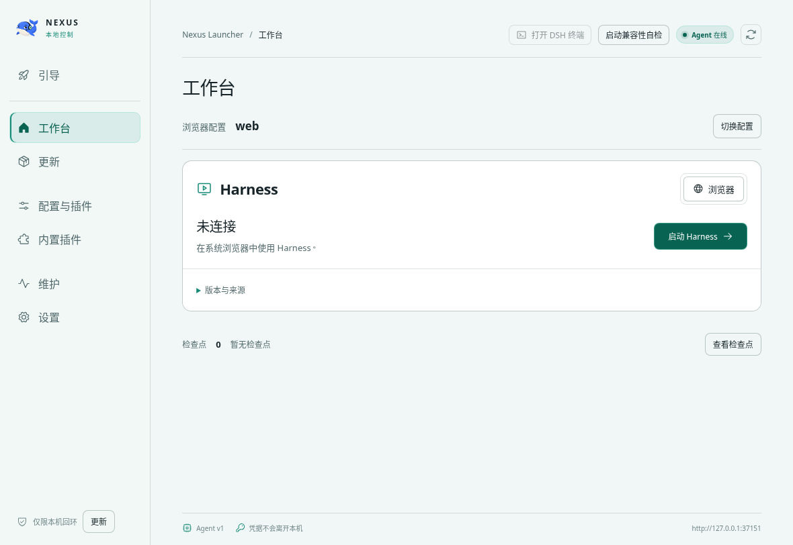
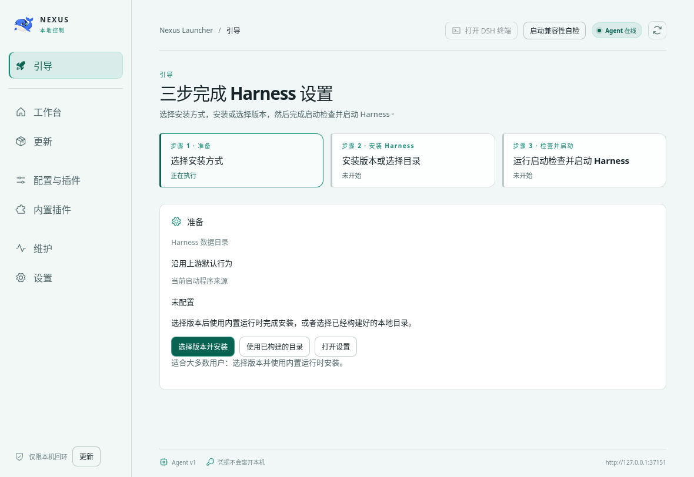
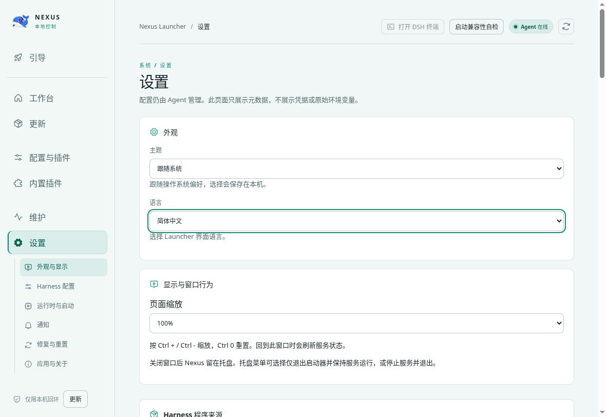

# Nexus Launcher

[English](README.md)

**管理 Harness 版本，选择启动方式，掌握本地数据。**

Nexus 是面向 Windows、macOS 和 Linux 的本地 [DeepSeek Harness](https://github.com/deepseek-ai/deepseek-harness) 桌面管理器。在一个界面中准备和切换版本、启动 Web 或受支持的官方 Desktop、管理配置档与插件，并处理启动问题。

[下载 v1.0.6](https://github.com/chelal233/dsh-nexus/releases/tag/v1.0.6) · [三步开始](#三步开始) · [用户指南](docs/user-guide.md) · [文档目录](docs/README.md)

*全部截图均来自 Debian 13 x86_64 上的 v1.0.5，使用隔离数据运行官方 DEB 原样解包后的程序：Agent 在线，尚未安装或运行 Harness；未执行系统安装。参见[采集说明](docs/images/README.md)。*

## 能做什么

- **先准备，再切换版本。** 并存管理多个 Harness 版本，停止 Harness 后显式切换；也可关联已经构建完成的外部目录。
- **选择 Web 或官方 Desktop。** 在浏览器中打开 Web Harness，或使用兼容受管版本中的上游官方 Desktop。工作台显示当前模式、配置档、启动状态与操作入口。
- **管理配置和插件。** 选择 Web 配置档，在受支持版本中调用 Harness 官方插件管理器，并在不启动插件的情况下检查配置。Desktop 使用独立的 `desktop` 配置档。
- **根据证据修复问题。** 检查启动错误，预览本地依赖修复，借助配置恢复点编辑损坏的配置档，或收集诊断。正常启动直接运行实际实例，需要时再进行额外诊断。
- **离线转移准备好的环境。** 导出程序、匹配的运行时与所选配置档／数据，在同系统、同架构下导入，并自行选择需要转移的内容。
- **掌握本地服务状态。** 从工作台和托盘启动、打开、重启或停止受支持的模式；退出 Nexus 时可选择保留 Harness 运行。界面提供中文与英文，并支持配置任务通知。

Nexus 管理 Harness 的生命周期；AI Agent、模型、工具和会话由 Harness 提供。Nexus 后台 Agent 是本地管理服务，与 Harness 的 AI Agent 不同。

## 下载与安装

当前版本为 **[v1.0.6](https://github.com/chelal233/dsh-nexus/releases/tag/v1.0.6)**。请选择与操作系统和 CPU 架构一致的安装包。

| 平台 | 架构 | 下载 | 官方 Harness Desktop |
| --- | --- | --- | --- |
| Windows | x64 | [EXE 安装包](https://github.com/chelal233/dsh-nexus/releases/download/v1.0.6/dsh-nexus_1.0.6_windows_x64.exe) · [免安装 ZIP](https://github.com/chelal233/dsh-nexus/releases/download/v1.0.6/dsh-nexus_1.0.6_windows_x64_portable.zip) | 兼容的受管版本可用 |
| Windows | ARM64 | [EXE 安装包](https://github.com/chelal233/dsh-nexus/releases/download/v1.0.6/dsh-nexus_1.0.6_windows_arm64.exe) · [免安装 ZIP](https://github.com/chelal233/dsh-nexus/releases/download/v1.0.6/dsh-nexus_1.0.6_windows_arm64_portable.zip) | 当前内置锁不提供支持 |
| macOS | Intel x64 | [DMG](https://github.com/chelal233/dsh-nexus/releases/download/v1.0.6/dsh-nexus_1.0.6_macos_x64.dmg) · [应用 ZIP](https://github.com/chelal233/dsh-nexus/releases/download/v1.0.6/dsh-nexus_1.0.6_macos_x64_portable.zip) | 兼容的受管版本可用 |
| macOS | Apple Silicon ARM64 | [DMG](https://github.com/chelal233/dsh-nexus/releases/download/v1.0.6/dsh-nexus_1.0.6_macos_arm64.dmg) · [应用 ZIP](https://github.com/chelal233/dsh-nexus/releases/download/v1.0.6/dsh-nexus_1.0.6_macos_arm64_portable.zip) | 兼容的受管版本可用 |
| Linux | x86_64 / x64 | [AppImage](https://github.com/chelal233/dsh-nexus/releases/download/v1.0.6/dsh-nexus_1.0.6_linux_x64.AppImage) · [DEB](https://github.com/chelal233/dsh-nexus/releases/download/v1.0.6/dsh-nexus_1.0.6_linux_x64.deb) · [RPM](https://github.com/chelal233/dsh-nexus/releases/download/v1.0.6/dsh-nexus_1.0.6_linux_x64.rpm) | 当前内置锁不支持，使用 Web |
| Linux | ARM64 | [AppImage](https://github.com/chelal233/dsh-nexus/releases/download/v1.0.6/dsh-nexus_1.0.6_linux_arm64.AppImage) · [DEB](https://github.com/chelal233/dsh-nexus/releases/download/v1.0.6/dsh-nexus_1.0.6_linux_arm64.deb) · [RPM](https://github.com/chelal233/dsh-nexus/releases/download/v1.0.6/dsh-nexus_1.0.6_linux_arm64.rpm) | 当前内置锁不支持，使用 Web |

六个平台目标均提供 Web 模式。Desktop 是否可用取决于所选 Harness 版本与运行时资源，不能仅凭存在 Nexus 安装包判断。

- **Windows：** 使用 EXE 安装，或完整解压 ZIP 后运行 `Nexus Launcher.exe`，不要单独复制可执行文件。免安装不代表用户数据与程序存放在同一目录。
- **macOS：** 从 DMG 或 ZIP 中复制完整应用后启动。v1.0.6 应用使用临时签名，**未经 Apple 公证**。
- **Linux：** 完整内置运行时需要 **glibc 2.34 或更新版本**、libcurl、zlib 及 Electron 桌面库。DEB/RPM 声明了依赖，AppImage 用户需自行核对系统环境。相同包格式或 deepin、统信 UOS、麒麟等发行版名称，不能保证其所有版本和桌面环境兼容。

Release 附件包含构建记录与 SHA-256 清单，Windows 和 Linux 安装包未签名。请参阅[下载校验与安全说明](SECURITY.md)；清单的 Sigstore 来源证明与操作系统代码签名是不同机制。

## 三步开始

1. **打开 Nexus。** 确认本地 Agent 在线，并处理界面显示的启动提示。
2. **选择 Harness。** 准备受管版本后选用，导入完整离线包，或关联已经构建完成的外部目录。准备版本不会自动切换当前版本。
3. **选择模式并启动。** 使用 Web 时，检查数据目录与所选配置档，处理阻断项后从工作台启动；客户端就绪后再打开浏览器。官方 Desktop 可用时可选用该模式，并在其窗口中管理配置。

## 版本、配置与 Agent

**更新 Nexus 和切换 Harness 是两个独立操作。** Nexus 不会自动升级你的 Harness。v1.0.5 修复了后台 Desktop 能力检查可能重新启动已被明确停止的 Nexus Agent 的竞态。 v1.0.6 将首次安装市场的版本更新为 dshmarket 1.66.8，保留已有市场版本。

内置 Desktop 运行时锁仍为 **Harness 0.1.6-alpha.2**。Nexus 也适配了部分较新 Harness 接口，包括 0.2 的设置与 Desktop 准备接口。接口适配不等于所有插件和会话数据迁移均已验证。升级前保留数据备份；选择旧版本不会把上游数据格式降级。

显式指定的 Node、pnpm、Git 路径优先，否则使用内置工具。内置 Git 包含 SSH 和 Git LFS，不包含 GCM。运行时与启动设置用于后续启动，不会替换已经运行的进程。

Web 使用 Nexus 中选定的配置档，官方 Desktop 使用 `profiles/desktop`，两者的插件设置不会自动同步。切换模式或版本、修改受保护配置、转移数据前，先停止当前模式。关闭窗口可能仍保留服务运行；需要停止时请使用明确的停止或“停止全部服务并退出”操作。

*设置页面顶部，更多设置区域需向下滚动查看。*

## 离线转移与数据安全

从已准备完成的环境导出**完整离线包**，选择**程序与运行时**，并带上需要的配置档、已安装插件及依赖、数据。在**同系统、同架构**下导入；先读取包内容，再选择导入项目。导入后 Harness 保持停止。仅配置／数据的部分包不能补足缺失的程序或运行时。

远程模型、插件下载和其他网络服务仍需联网，除非这些服务本身部署在本地。外部源码目录需自行提前构建完成，Nexus 不会代为安装开发工具链。

离线包**不加密**。凭据和 `.env` 是可选的敏感内容，会话历史也可能包含隐私。请只转移必要内容，妥善保管离线包，并只导入可信来源的文件。会话历史转移不包含项目工作区文件。

Nexus 程序、Nexus 管理数据、Harness 数据（`DSH_HOME`）和项目工作区分别存放。修改 `DSH_HOME` 不会搬移或删除旧目录。配置恢复点和快照仅覆盖其声明范围，不能替代包含所有项目、会话和密钥的完整备份。

## 兼容性与验证范围

- 启动状态区分检查中、就绪、功能受限、失败和未验证。进程已运行或窗口已打开，不等于每个模型、工具、会话和第三方插件均可用。
- v1.0.6 发行门禁覆盖六平台构建、资源核验和 CI runner 上的实际安装包启动。CI 通过与校验清单来源证明不等于生产级操作系统签名、所有 Linux 发行版兼容或用户真机升级验收。
- macOS 完整浏览器内 Web 会话、真实会话／完整离线迁移、全部第三方插件、真机升级、Gatekeeper 首次打开、生产公证及崩溃恢复仍未验收。此前 v1.0.4 Mac 子集检查不能作为 v1.0.6 完整迁移验收，详见 [v1.0.6 发布说明](https://github.com/chelal233/dsh-nexus/releases/tag/v1.0.6)。
- Harness 及其插件具有普通本地进程的权限。Nexus 不提供运行不可信插件的安全沙箱。

## 文档与参与

- 使用：[用户指南](docs/user-guide.md)、[配置说明](docs/configuration.md)、[故障处理](docs/troubleshooting.md)、[官方 Desktop](docs/harness-desktop.md)
- 开发：[贡献指南](CONTRIBUTING.md)、[开发环境](apps/nexus-launcher/README.md)、[架构](docs/architecture-baseline.md)、[发布流程](docs/github-release.md)、[插件说明](plugins/README.md)
- 动态：[发行版本](https://github.com/chelal233/dsh-nexus/releases)、[变更记录](CHANGELOG.md)、[历史证据](docs/history/README.md)

Nexus 是独立项目，不代表上游 Harness 官方发布。自有代码采用 [MIT 许可证](LICENSE)，第三方组件遵循各自许可证，见[第三方许可材料](THIRD_PARTY_NOTICES.md)。

感谢 [LINUX DO](https://linux.do/) 社区提供开放、友善的技术交流平台。
