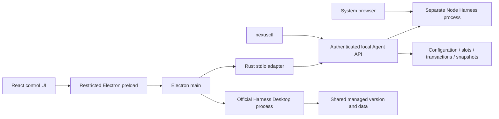

# Architecture and ownership

[简体中文](architecture-baseline.md)

Electron is the only current desktop host. Nexus manages Harness lifecycle; it does not implement a second Harness Agent or conversation engine.

## Source map

| Module | Responsibility |
| --- | --- |
| `apps/nexus-launcher/src` | React pages, configuration drafts, notification and recovery guidance |
| `apps/nexus-launcher/electron` | Windows, tray, notifications, updates, restricted IPC |
| `crates/nexus-launcher` | Desktop stdio adapter |
| `crates/nexus-launcher-core` | Agent discovery, identity, authenticated transport, startup coordination |
| `crates/nexus-agent` | Harness lifecycle, runtime resolution, version preparation, compatibility, recovery |
| `crates/nexus-core`, `nexus-protocol` | Persistence and shared protocol |
| `crates/nexus-snapshots`, `nexus-private-file` | Scoped snapshots, private files and platform file operations |
| `plugins/<name>` | Independently maintained built-in plugins |

## State and configuration

The Agent owns business state. A successful click is not evidence that a background transaction completed. Durable operations use receipts, ownership, and recovery records; uncertain writes must not be blindly replayed. Current-instance launch evidence and next-launch configuration are distinct.

Bundled runtimes resolve against the current installation; external pins remain user choices. Managed slots, external programs, Harness data, and project workspaces are distinct. Switching versions is not data migration.

## Security and compatibility

Renderers use sandboxing and context isolation with Node integration disabled. IPC validates senders and allowed commands. Loopback is not a substitute for authentication. Harness and third-party plugins retain normal local-process capabilities; Nexus is not a hostile-code sandbox.

Built-ins deploy through the selected Harness extension mechanism. Local manifest checks establish declarations only. Web and official Desktop are mutually exclusive execution modes sharing managed versions and data, not two windows around the same Web page. Electron main prepares and supervises Desktop using upstream native capabilities, without injecting Nexus Web compatibility plugins. Cross-version support depends on actual APIs and data compatibility, not version strings alone.

See [interruption recovery](interrupted-operation-recovery.en.md) and [acceptance](acceptance.en.md).
