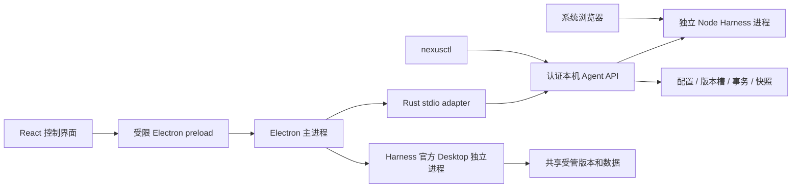

# 架构与职责边界

[English](architecture-baseline.en.md)

当前桌面宿主只有 Electron。Nexus 管理 Harness 生命周期，不维护第二套 Harness Agent 或对话引擎。

## 源码定位

| 模块 | 职责 |
| --- | --- |
| `apps/nexus-launcher/src` | React 页面、配置草稿、通知与恢复引导 |
| `apps/nexus-launcher/electron` | 系统窗口、托盘、通知、更新、受限 IPC |
| `crates/nexus-launcher` | 桌面 stdio adapter |
| `crates/nexus-launcher-core` | Agent 发现、身份验证、认证传输及启动协调 |
| `crates/nexus-agent` | Harness 启停、运行时解析、版本准备、兼容检查、恢复 |
| `crates/nexus-core`、`nexus-protocol` | 持久化与共享协议 |
| `crates/nexus-snapshots`、`nexus-private-file` | 范围化快照、私密文件与平台文件操作 |
| `plugins/<name>` | 独立维护的内置插件 |

## 状态与配置

Agent 拥有业务状态；页面不得用按钮点击成功推断后台事务完成。持久操作使用回执、所有权和恢复记录，不确定的写入不能盲目重放。当前进程的启动记录与下次启动配置分别展示。

内置运行时按当前安装解析；外部固定路径由用户控制。受管版本目录、外部程序目录、Harness 数据与项目工作区互相独立。切版本不等于数据迁移。

## 安全与兼容

Electron renderer 使用 sandbox、context isolation，关闭 Node integration，IPC 检查来源和允许的命令。本机回环不是认证替代品。Harness 和第三方插件仍拥有普通本机进程能力，不是被 Nexus 沙箱隔离的恶意代码。

内置插件使用所选 Harness 的扩展机制部署；本地 manifest 检查仅提供声明证据。Web 和官方 Desktop 是互斥的运行模式，共享受管版本与数据，不是把同一个 Web 页面包进另一个窗口。Desktop 由 Electron 主进程准备和监管，并使用上游原生能力；不注入 Nexus 的 Web 兼容插件。跨版本支持依赖具体接口和数据兼容，而非版本号字符串本身。

恢复机制见[中断恢复](interrupted-operation-recovery.md)，验证范围见[验收清单](acceptance.md)。
