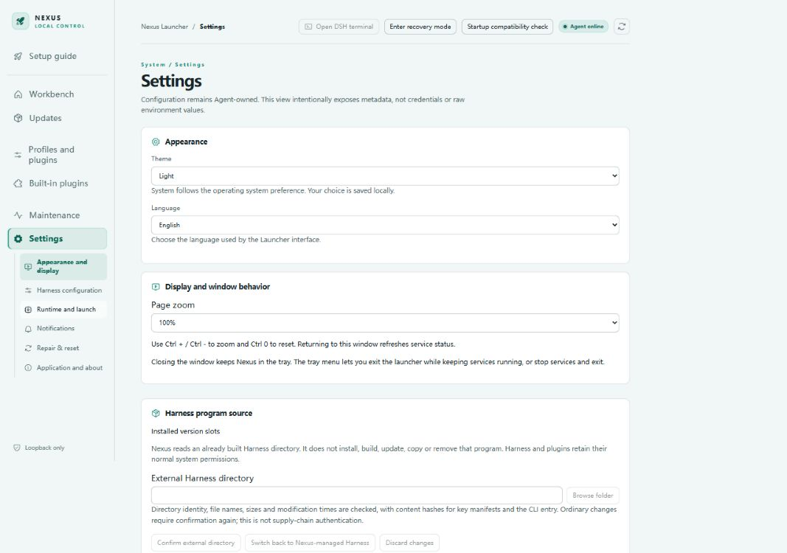

# Configuration and when it takes effect

[简体中文](configuration.md)

This page describes the current source. Runtime-path and save fixes are unreleased; it does not imply v0.1.7 contains them. See the [changelog](../CHANGELOG.en.md).

## Saved settings, next launch, current instance

| Setting | After saving | Effect on running Harness |
| --- | --- | --- |
| Node, pnpm, Git selection | Subsequent starts and dependency operations use it; refresh runtime checks manually | Does not replace an existing process |
| Harness arguments, data directory, profile, patches | Used on subsequent starts; some actions require Harness stopped | No live replacement inside the process |
| Harness update source | Used for subsequent fetch/preparation; finish active updates first | Does not change the current version |
| Snapshot settings | Read by subsequent snapshot operations; active operations remain protected | Does not modify the current session |
| Notification categories/conditions | Read by the notification pipeline after saving | Observer loading changes require a Harness restart |
| Theme, language, zoom | Applied to the current Launcher | Does not alter Harness settings |
| Automatic updates | Controls subsequent automatic checks; manual checks are separate | Harness stops only when applying an update |
| Agent log level | Used on the next Agent start | Does not reconfigure a running Agent |

Next launch inputs describes resolved configuration. Current instance inputs records what that instance actually started with. A difference is not necessarily a defect. Ordinary saved settings must not require restarting all of Nexus to update the next Harness launch.

## Bundled and external runtimes

Node/npm/pnpm are bundled by default. npm belongs to the Node runtime combination; these are not arbitrary interchangeable tools. Embedded Git capability does not imply a complete external Git CLI.

Current source resolves `bundled` runtimes relative to the current installation and preserves explicit external selections. Earlier versions may retain automatically generated absolute paths. Directory names alone cannot establish whether a user deliberately pinned a path.

Saving runtime settings keeps an automatically generated Node launch entry linked to the runtime. A separately specified launch program retains its own precedence. Clearing runtime pins does not clear an independently configured custom program.

## Environment overrides and conflicts

Environment variables may override saved file settings; the interface indicates relevant overrides. Processes inherit environment variables at creation, so changing a parent environment cannot update an existing child. This does not mean ordinary settings require restarting Nexus.

Configuration saves check revisions. If another operation changed the document, retain the draft, refresh, and retry rather than overwriting newer content. Runtime, version-switch, and recovery operations still respect mutual exclusion.

## Data and patches

Changing data directories does not migrate files. Patches are composed through the selected Harness's supported mechanism; order and enablement affect the result. Launch input descriptions are not the entire upstream merged configuration. Do not publish secrets from diagnostic, patch, or configuration files.
