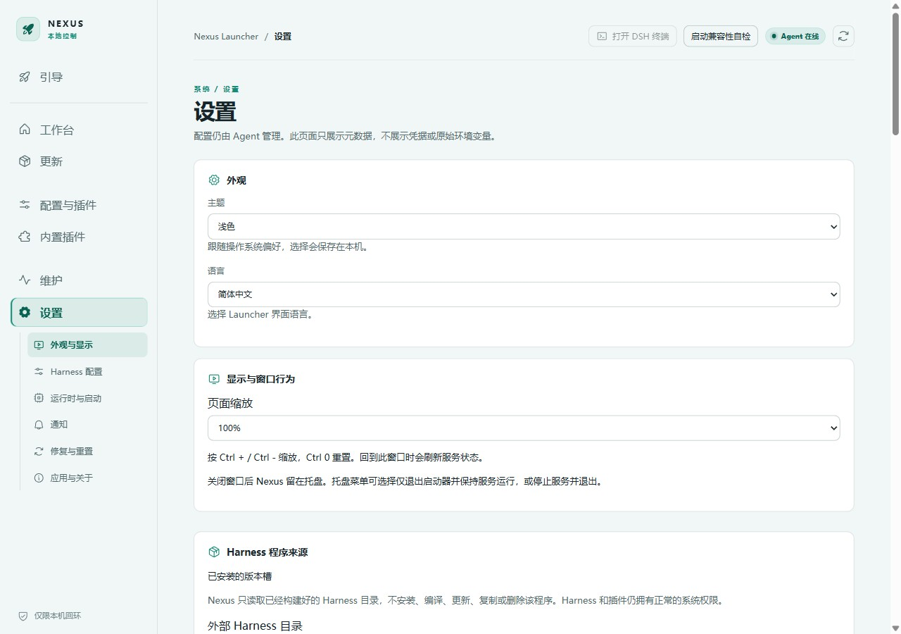

# 配置与生效时机

[English](configuration.en.md)

本文以 v0.1.8 为基线；运行时路径与保存修复已随该版本发布，v0.1.7 仍可能受影响。见[变更记录](../CHANGELOG.md)。

## 保存、下次启动、当前实例

| 设置 | 保存后的行为 | 是否影响当前 Harness |
| --- | --- | --- |
| Node、pnpm、Git 运行时选择 | 后续启动和依赖操作读取新值；运行时检查需手动刷新 | 不替换已运行进程 |
| Harness 启动参数、数据目录、profile、配置补丁 | 后续启动使用；部分操作要求先停止 Harness | 不在进程中热替换 |
| Harness 更新源 | 后续拉取/准备使用；进行中的更新需先结束 | 不改变当前版本 |
| 快照设置 | 后续快照操作读取；活动操作受互斥保护 | 不修改当前会话 |
| 通知分类与条件 | 保存后由通知链路读取 | 通知插件装载开关需重启 Harness |
| 主题、语言、缩放 | 当前 Launcher 界面应用 | 不改变 Harness 配置 |
| 自动更新开关 | 控制后续自动检查；手动检查独立 | 应用更新时才停止 Harness |
| Agent 日志级别 | 下一次 Agent 启动使用 | 不热改运行中的 Agent |

“下次启动输入”是配置解析结果；“当前实例启动输入”是该实例启动时记录的事实。两者不同并不一定是错误。保存成功不要求重启整个 Nexus 才能更新下一次 Harness 启动输入。

## 内置与外部运行时

默认使用随包 Node/npm/pnpm。`npm` 属于 Node 组合，不是三个独立可随意混配的工具。内置 Git 能力不等于提供完整外部 Git CLI。

当前源码按运行时来源解析：`bundled` 跟随当前安装目录，显式外部路径保持用户选择。旧版自动生成的绝对路径可能残留；不能仅通过目录名称猜测用户是否有意固定它。

运行时保存与自动生成的 Node 启动入口保持关联；独立指定的启动程序仍有自己的优先级。清空运行时固定路径不等于清空另行指定的自定义启动程序。

## 环境变量与配置冲突

外部环境变量可能覆盖文件设置，界面会提示相关覆盖。环境变量由进程继承，改变父进程环境不会修改已经启动的子进程。不要将这个规则误认为普通设置必须重启 Nexus。

配置保存使用 revision 检查；发现其他操作已改配置时，保留草稿并刷新后重试，不以旧内容覆盖新内容。运行时、版本切换、恢复等互斥操作仍需等待完成。

## 数据与补丁

修改数据目录不会迁移文件。运行补丁通过所选 Harness 支持的方式叠加，顺序和启用状态影响结果；启动输入说明不是上游合成后的全部最终配置。不要把诊断、补丁或配置文件中可能存在的密钥直接发到公开 Issue。

## Web 与官方 Desktop

Web 配置档可从工作台或配置与插件页面切换；官方 Desktop 在自己的窗口中管理配置。两种模式共享受管版本与数据，切换模式、改版本或导出数据前先停止当前运行。Desktop 使用锁定的离线运行时，不能把 Web 运行时设置理解为可任意替换 Desktop 的运行时。见[桌面端说明](harness-desktop.md)。
