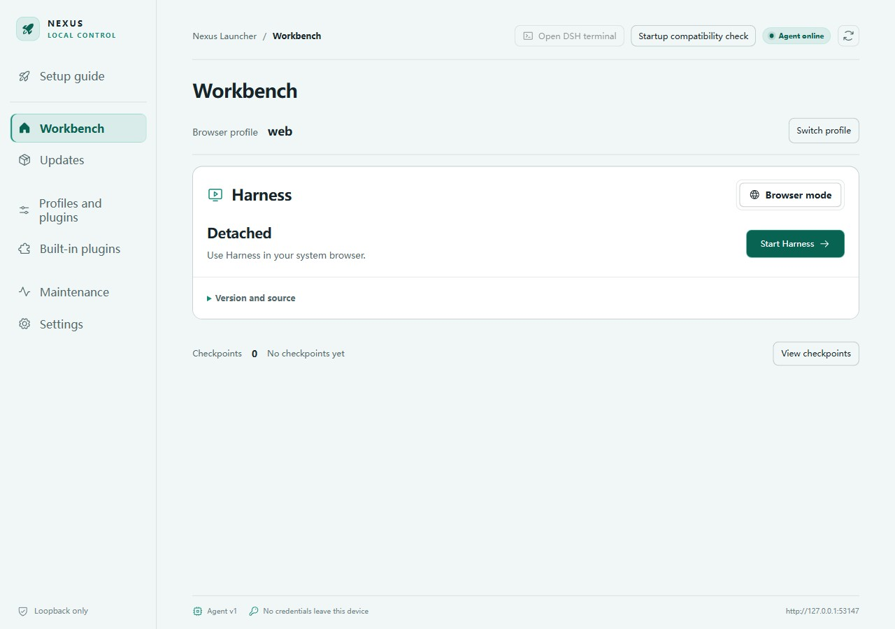

# User guide

[简体中文](user-guide.md)

## Choose a program source

The guide offers managed installation and an external source. Nexus downloads, prepares dependencies, and registers managed version slots. An external source must already be built; linking it does not copy or update it. Both paths require a usable runtime and startup checks.

Having no sessions or versions is expected on first use. This screenshot is not a running Harness demonstration.

## Distinguish three directories

- Nexus program directory: the complete application and its `resources`.
- Harness program directory: a managed slot or your external source/build directory.
- Harness data directory: `DSH_HOME`, holding Harness user data; leaving it unset preserves the upstream default.

Harness selects project workspaces separately. Changing `DSH_HOME` changes the location read, not the contents of the old directory. If sessions disappear after downgrading, first check the data directory, profile, and upstream data format rather than assuming deletion.

## Startup and daily use

Run startup checks and inspect each `blocked` item and repair link. Passing basic checks does not guarantee plugins will boot. Compatibility checks provide additional evidence, not a guarantee of every business workflow.

Use Workbench to start or stop Harness and inspect the current instance. Web uses the system browser; supported releases also offer official Harness Desktop. They share managed versions and data, so stop the active mode before starting the other. Switch Web profiles in Workbench; manage Desktop configuration in its official window. The DSH terminal uses the selected version and profile. A globally installed `dsh` command may point elsewhere.

Closing the Launcher window normally hides it to the tray. Use an explicit stop or stop-services-and-exit action when needed; closing the interface does not itself stop tasks.

## Plugins and notifications

Built-in plugins offers a market choice, including no market and self-management. Local declaration checks inspect manifests of the local plugins being processed; they do not fetch every npm historical version while browsing. Valid declarations do not prove API, behavior, or data-format compatibility.

Choose notifications by event, including turn completion, failure, approval, questions, and background tasks. Configure system and terminal delivery separately. Unfocused-only refers to the task page, not Launcher focus. The observer plugin toggle takes effect on the next Harness start. OS permissions, do-not-disturb, and terminal focus support affect delivery.

## Two separate updates

**Nexus update (current source, not yet released)**: automatic checks run at startup and every two hours; manual checks remain available when disabled. Checks only announce availability. Click Update to open a confirmation dialog, then choose Confirm and download. Progress appears in that dialog; closing it keeps this explicitly requested download running. Once verified, choose Restart later or Update and restart. Save work and stop Harness before installing, then restart Harness manually afterward. The published v0.1.8 package still downloads automatically after detecting an update.

**Harness update**: prepare an upstream version on the Updates page, then switch explicitly. Stop Harness before switching and follow the current protection checks. Versions may use different data formats; Nexus does not promise automatic downgrade compatibility.

Portable users may download and fully extract a new package. The stale bundled-runtime path issue affecting v0.1.7 is fixed in v0.1.8. See [troubleshooting](troubleshooting.en.md).

## When something fails

Keep the original error and build ID. Inspect the actual blocking item, then use its settings, recovery, or diagnostics entry. Do not delete transaction records to silence errors, or start by deleting `.dsh`. Checkpoints cover declared scope, not a complete backup of all projects, sessions, and secrets.

## Full offline transfer

Acquire and prepare a supported Harness version, then export a full package including Harness and its runtimes. Import on the same OS and architecture without downloading dependencies. Configuration/data-only exports are partial backups, not standalone offline environments. Desktop preparation uses local resources and shows progress, elapsed time, and cancellation. Remote models and network plugins still require their services to be reachable. See [Desktop and offline delivery](harness-desktop.en.md).

Web uses the profile selected in Nexus. Official Desktop uses its separate `profiles/desktop`; Workbench displays desktop and omits the Web profile switch in Desktop mode. Plugin settings do not synchronize automatically. Desktop startup also checks actual client loading, displays failures and retains official recovery.
