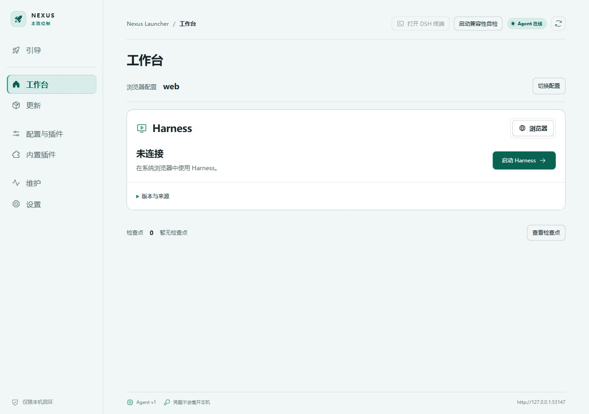

# 用户指南

[English](user-guide.en.md)

## 先选程序来源

引导页提供两条路径。受管安装由 Nexus 下载、准备依赖并登记版本槽位；外部来源要求你事先构建好 Harness。外部目录关联不会复制或更新该目录。两条路径都需要可用运行时和启动检查。

首次使用没有会话或版本是正常状态，截图不是正在运行的 Harness 演示。

## 确认三个不同目录

- Nexus 程序目录：存放完整应用和 `resources`。
- Harness 程序目录：某个受管版本槽位，或自行提供的外部源码/构建目录。
- Harness 数据目录：`DSH_HOME`，保存 Harness 的用户数据；留空沿用上游默认值。

项目工作区由 Harness 自己选择。改 `DSH_HOME` 只改变读取位置，不搬迁旧目录。切换旧版后看不到会话，不应立即认定数据被删；先确认数据目录、profile 和上游版本的数据格式。

## 启动与日常使用

执行启动检查，查看每个 `blocked` 项的具体原因及修复入口。全部基础检查通过仍不代表插件启动一定成功。启动兼容性自检可以发现更多问题，但也不是对所有业务行为的担保。

在工作台启动或停止 Harness，并查看当前实例状态。Web 使用系统浏览器；支持时可以改用 Harness 官方 Desktop。两者共用受管版本与数据，须先停止当前模式再启动另一种模式。Web 配置档可在工作台切换，Desktop 配置在官方窗口中管理。DSH 终端使用所选版本和 profile；不要把全局安装的 `dsh` 命令误认为当前 Nexus 管理的版本。

关闭 Launcher 窗口通常隐藏到托盘。需要停止服务时使用明确的停止或停止服务并退出操作；单纯关闭界面不等于停止任务。

## 插件与通知

在“内置插件”选择是否使用插件市场，也可以选择不安装市场、自行管理。Nexus 的本地声明检查读取正在处理的本地插件 manifest，不为每次浏览请求整个 npm 历史版本列表。声明通过不代表运行时 API、行为和数据格式兼容。

通知可按回合完成、失败、审批、回答、后台任务等事件选择。系统通知与终端提醒分别配置；“仅失焦”关注任务页面而非 Launcher 窗口。通知插件开关在下次 Harness 启动时生效。系统勿扰、权限及终端焦点支持会影响呈现。

## 两种更新

**Nexus 更新（当前源码，尚未发布）**：自动检查在启动时及此后每两小时执行；关闭自动检查后仍可手动检查。检查仅提示新版本，点击“更新”打开确认窗口，再点击“确认并下载”才开始下载。窗口内显示进度，关闭窗口后本次已确认的下载继续。校验完成后可选“稍后重启”或“更新并重启”；应用前先保存工作并停止 Harness，更新后再手动启动 Harness。已发布的 v0.1.8 包仍采用检测后自动下载的旧流程。

**Harness 更新**：在更新页准备上游版本，准备与切换分开。切换前停止 Harness，按当前保护要求确认。不同版本可能使用不同数据格式，Nexus 不自动承诺数据降级兼容。

便携包也可以直接下载并完整解压新版。v0.1.7 的旧内置运行时路径残留问题已在 v0.1.8 修复，处理方式见[故障指南](troubleshooting.md)。

## 出错时

保留原始错误和构建编号，先看具体阻断项，再进入对应设置、恢复或诊断页面。不要为了清除提示手动删除事务记录，也不要先删除 `.dsh`。检查点只覆盖声明范围，不是所有项目、会话和密钥的完整备份。

## 完整离线迁移

取得并准备受支持的 Harness 版本后，导出包含 Harness 与运行时的完整包，在同系统、同架构下导入，无需联网补装依赖。仅配置／数据导出是部分备份，不是可独立启动的离线环境。Desktop 准备使用本地资源，并显示阶段、耗时和取消入口；远程模型及联网插件仍需其服务可达。见[桌面端与离线交付](harness-desktop.md)。

Web 使用 Nexus 选中的配置档；官方 Desktop 固定使用独立的 `profiles/desktop`。工作台在桌面模式显示 desktop，不再显示 Web 的配置切换按钮。两者不自动同步插件设置。Desktop 启动时也会检查实际客户端是否完成加载，失败时展示错误并保留官方修复入口。
